# Document Validation Rules — Base Functions & Rule Engine

---

## `base.py` — Common Functions

`base.py` holds every building block the individual rules share. Functions are grouped by what they do; the last column shows which rules consume them.

### Core types and result helpers

| Function | Type | Purpose | Used by |
|---|---|---|---|
| `Finding` | class | Stores the result of a rule check. | All rules |
| `Rule` | class | Base interface implemented by every rule. | All rules |
| `RuleConfig` | class | Stores configurable rule settings. | All rules |
| `ok()` | helper | Creates a passing `Finding`. | All rules |
| `fail()` | helper | Creates a failing `Finding`. | All rules |
| `na()` | helper | Creates a not-evaluated `Finding`. | Rule 10 (and any rule that skips) |
| `rule_metadata()` | helper | Provides rule information for the registry / UI. | Rule engine |

### Text normalization and comparison

| Function | Purpose | Used by |
|---|---|---|
| `normalize_key()` | Normalizes text for comparison. | Rule 1 |
| `normalize_filename()` | Cleans a filename for title comparison. | Rule 1 |
| `normalize_title()` | Cleans a document title for comparison. | Rule 1 |
| `similarity()` | Calculates fuzzy text similarity. | Rule 1 |
| `digits_conflict()` | Detects conflicting numbers or identifiers. | Rule 1 |

### Headings

| Function | Purpose | Used by |
|---|---|---|
| `first_heading1()` | Gets the first Heading 1. | Rule 1 |
| `iter_headings()` | Iterates through headings. | Rules 8, 10 |
| `is_heading()` | Checks whether content is a heading. | Rules 8, 10, 12 |
| `heading_level()` | Gets heading level information. | Rule 8 |
| `normalized_heading_text()` | Normalizes heading text. | Rule 10 |

### Versions and dates

| Function | Purpose | Used by |
|---|---|---|
| `find_versions()` | Finds version numbers. | Rule 4 |
| `parse_date()` | Parses date text. | Rule 3 |
| `find_dates()` | Finds dates in document content. | Rules 3, 7 |
| `has_date()` | Checks whether date information exists. | Rule 7 |

### Tables

| Function | Purpose | Used by |
|---|---|---|
| `table_labeled_values()` | Gets labeled values from tables. | Rules 2, 4 |
| `table_header_cells()` | Gets table headers. | Rule 6 |
| `table_is_populated()` | Checks whether a table contains useful data. | Rules 3, 5, 6 |
| `header_column_index()` | Finds a column by its header. | Rule 3 |
| `tables_after_heading()` | Finds tables following a heading. | Rule 5 |

### Revision history

| Function | Purpose | Used by |
|---|---|---|
| `find_revision_heading()` | Finds a revision-history heading. | Rule 5 |
| `find_revision_table()` | Finds the revision-history table. | Rules 3, 5 |
| `looks_like_revision_table()` | Identifies likely revision tables. | Internal — backs `find_revision_table()` |

### Signatures

| Function | Purpose | Used by |
|---|---|---|
| `signature_paragraphs()` | Finds paragraph-based signature labels. | Rules 6, 7 |

### Evidence and utilities

| Function | Purpose | Used by |
|---|---|---|
| `snippet()` | Creates short evidence text. | Rules 2–13 |
| `Locator` | Provides document location / evidence information. | Rules 7, 8, 11, 13 |
| `dedupe()` | Removes duplicate items. | Rule 9 |

---

# Rule 1 — Title / Filename Match

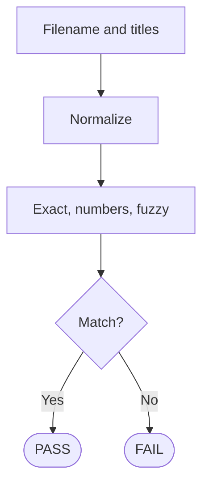

| Base function | What the rule uses it for |
|---|---|
| `normalize_key()` | Normalizes comparison text. |
| `normalize_filename()` | Normalizes filename. |
| `normalize_title()` | Normalizes title. |
| `digits_conflict()` | Detects conflicting numbers. |
| `similarity()` | Performs fuzzy comparison. |
| `first_heading1()` | Gets the first main heading. |
| `strip_extension()` * | Removes filename extension. |
| `strip_noise()` * | Removes irrelevant noise. |
| `strip_leading_number()` * | Removes leading numbering. |
| `_digit_sets()` * | Extracts numbers. |

\* Rule-local helpers, not part of the shared `base.py` surface.

**Description:** Compares the filename with possible document titles. It normalizes the values, checks exact matches, prevents conflicting numbers from passing, and uses fuzzy similarity when needed.

---

# Rule 2 — Author Name and Role

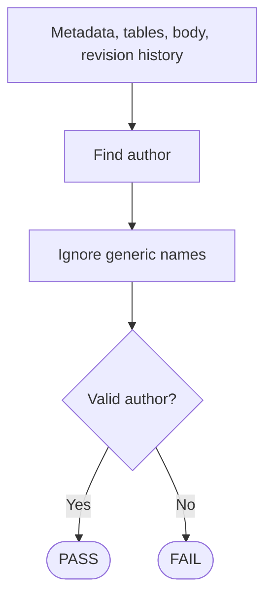

| Base function | What the rule uses it for |
|---|---|
| `table_labeled_values()` | Reads author / role information from tables. |
| `snippet()` | Creates evidence. |
| `ok()` / `fail()` | Creates the result. |

**Description:** Looks for a valid author in metadata, information tables, body paragraphs, and revision history. Generic / default names are ignored.

---

# Rule 3 — Revision-History Dates

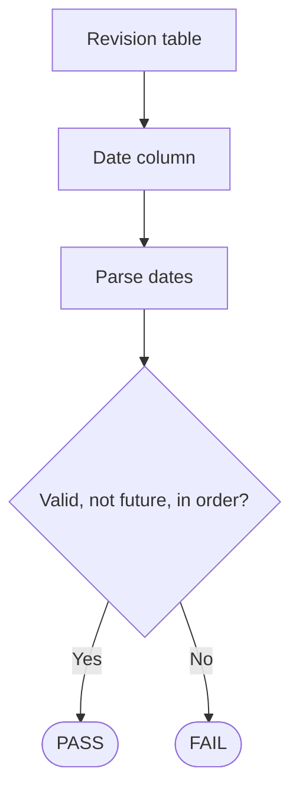

| Base function | What the rule uses it for |
|---|---|
| `find_revision_table()` | Locates the revision table. |
| `header_column_index()` | Finds the Date column. |
| `parse_date()` | Parses date values. |
| `find_dates()` | Finds dates when needed. |
| `table_is_populated()` | Checks that the table has data. |
| `snippet()` | Creates evidence. |

**Description:** Checks that revision history has valid dates, dates are not unexpectedly in the future, and revisions are in chronological order.

---

# Rule 4 — Version Number Present

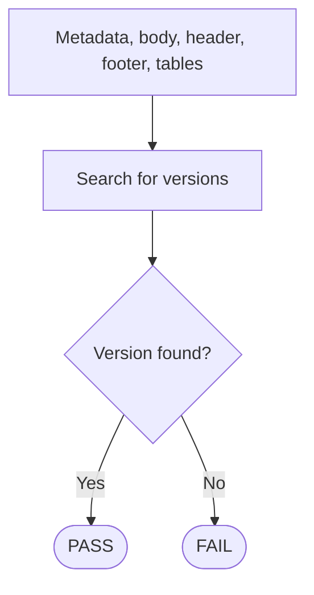

| Base function | What the rule uses it for |
|---|---|
| `find_versions()` | Finds version numbers. |
| `table_labeled_values()` | Reads version information from tables. |
| `snippet()` | Creates evidence. |
| `ok()` / `fail()` | Creates the result. |

**Description:** Searches different document areas for version numbers, including metadata, document content, tables, and revision history.

---

# Rule 5 — Revision Section Present

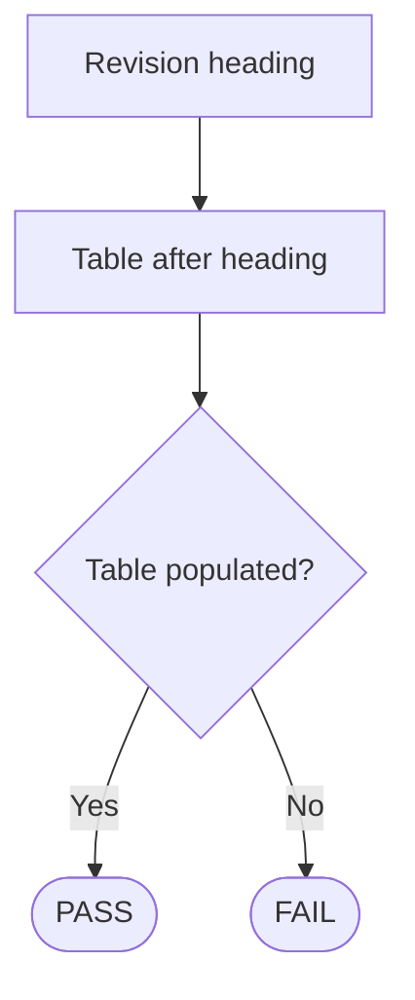

| Base function | What the rule uses it for |
|---|---|
| `find_revision_heading()` | Finds the revision-history heading. |
| `tables_after_heading()` | Finds tables below the heading. |
| `table_is_populated()` | Checks table content. |
| `find_revision_table()` | Provides fallback revision-table detection. |

**Description:** Verifies that a revision-history section exists and contains a populated table. If the heading is missing, a populated revision table found elsewhere acts as a fallback.

---

# Rule 6 — Signature Blocks Present

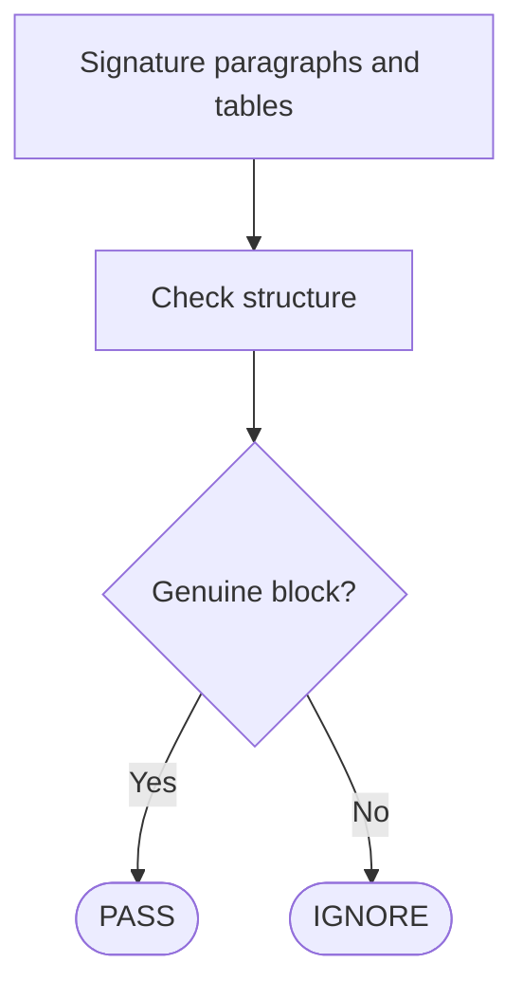

| Base function | What the rule uses it for |
|---|---|
| `signature_paragraphs()` | Finds signature-related paragraph labels. |
| `table_header_cells()` | Reads signature table headers. |
| `table_is_populated()` | Checks signature table content. |
| `snippet()` | Creates evidence. |

**Description:** Looks for genuine signature or approval blocks. Structured signature tables are strong evidence; ordinary sentences containing "approved by" should not automatically be treated as signature blocks.

---

# Rule 7 — Dates Near Signature Blocks

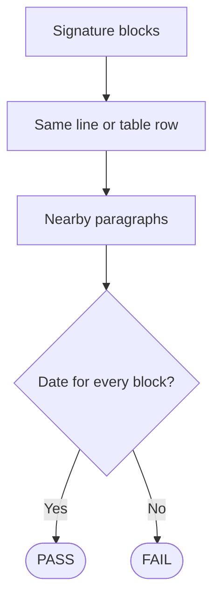

| Base function | What the rule uses it for |
|---|---|
| `signature_paragraphs()` | Identifies signature-related blocks. |
| `find_dates()` | Finds nearby dates. |
| `has_date()` | Checks date presence. |
| `snippet()` | Creates evidence. |
| `Locator` | Helps identify document locations. |

**Description:** Checks that genuine signature blocks have an associated date, first in the same line / table row and then in nearby content.

---

# Rule 8 — Font and Spacing Consistency

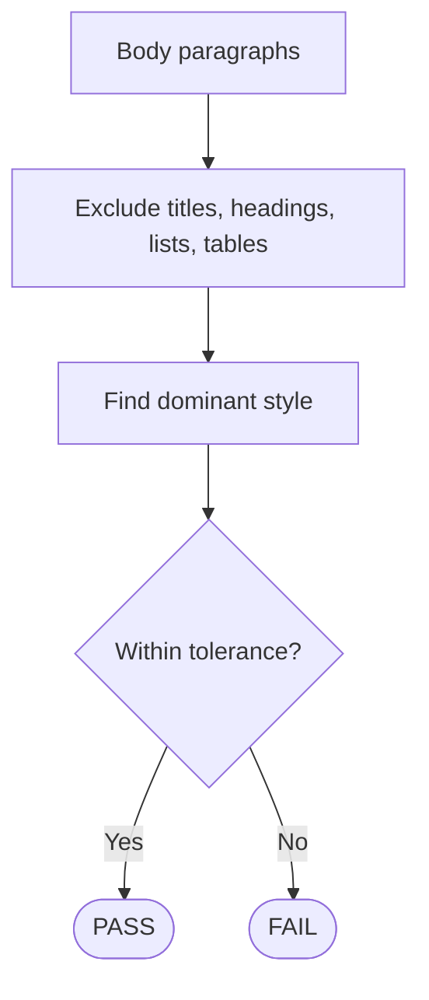

| Base function | What the rule uses it for |
|---|---|
| `is_heading()` | Excludes headings. |
| `heading_level()` | Identifies heading levels. |
| `iter_headings()` | Iterates through headings. |
| `snippet()` | Creates formatting evidence. |
| `Locator` | Provides paragraph locations. |

**Description:** Establishes the dominant body formatting and compares normal body paragraphs against it. Cover / title content and specialized elements should not be treated as ordinary body paragraphs.

---

# Rule 9 — Language Errors

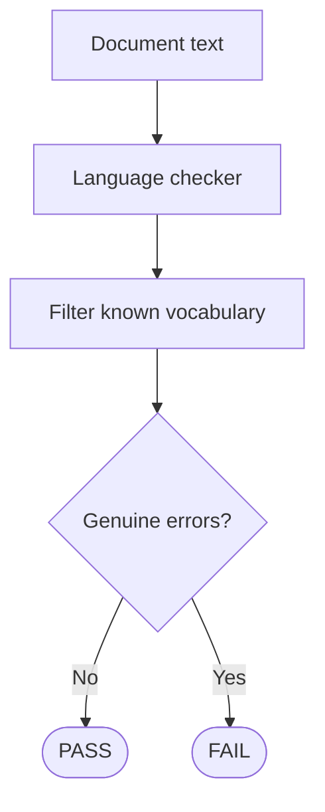

| Base function | What the rule uses it for |
|---|---|
| `LanguageChecker` * | Defines the language-checking interface. |
| `snippet()` | Creates evidence around errors. |
| `dedupe()` | Removes duplicate findings. |

\* Provided by the language-checking module rather than `base.py`.

**Description:** Sends document text through the configured language checker. Domain terms, identifiers, and valid language variants should be configurable to prevent false positives.

---

# Rule 10 — Required Sections

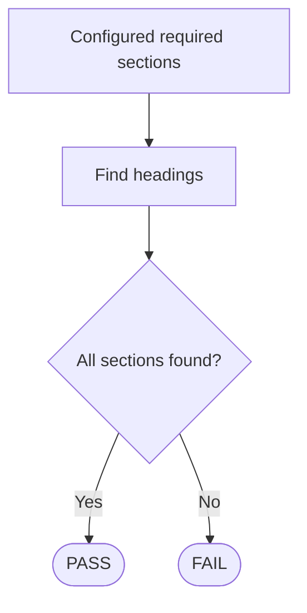

| Base function | What the rule uses it for |
|---|---|
| `iter_headings()` | Searches document headings. |
| `normalized_heading_text()` | Normalizes heading names. |
| `is_heading()` | Identifies headings. |
| `snippet()` | Creates evidence. |

**Description:** Checks whether configured required sections exist. If none are configured, the rule is not evaluated.

---

# Rule 11 — Page Numbers

```mermaid
flowchart TD
    A[Footers] --> B[Look for PAGE field]
    B --> C{Dynamic page number?}
    C -- Yes --> P([PASS])
    C -- No --> F([FAIL])
```

| Base function | What the rule uses it for |
|---|---|
| `snippet()` | Creates footer evidence. |
| `Locator` | Provides document location information. |

**Description:** Checks footers for a dynamic `PAGE` field and identifies likely hardcoded page numbers. DOCX structure does not directly provide final rendered pagination.

---

# Rule 12 — Readability

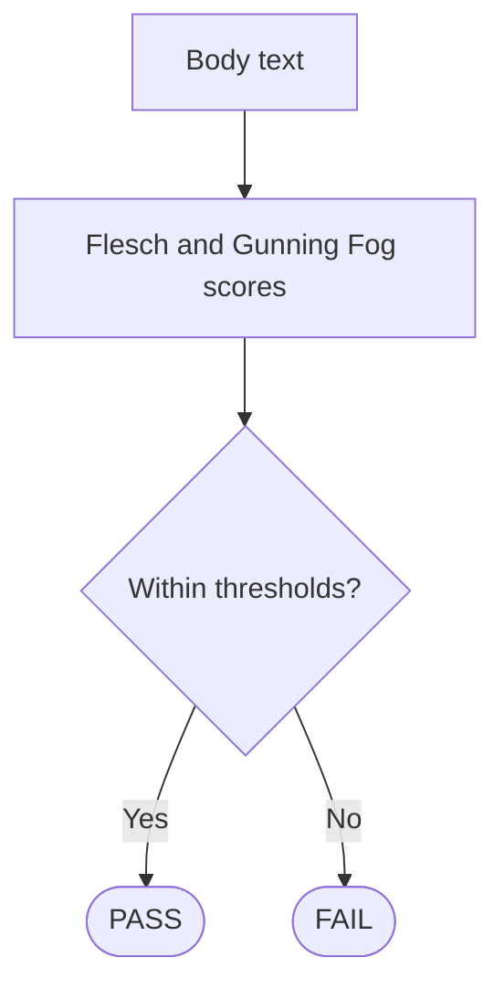

| Base function | What the rule uses it for |
|---|---|
| `is_heading()` | Helps exclude headings. |
| `snippet()` | Creates evidence. |

**Description:** Calculates readability metrics from body text and compares them with configured Flesch Reading Ease and Gunning Fog thresholds.

---

# Rule 13 — Footer Details

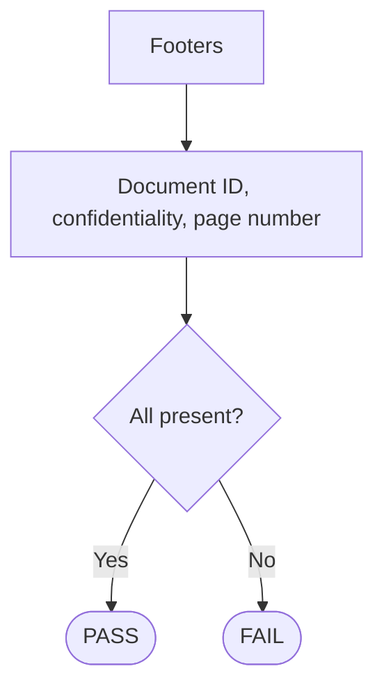

| Base function | What the rule uses it for |
|---|---|
| `snippet()` | Creates footer evidence. |
| `Locator` | Provides location information. |

**Description:** Checks that footers contain the required document ID, confidentiality information, and page numbering.

---

# How the Rule Engine Calls the Rules

**Flow:**
`Application/API → Rule Engine → REGISTRY → Rules 1–13 → Findings → Results → API/UI`

The rule engine is the central coordinator.

| Function | Role |
|---|---|
| `_MODULES` | Holds the rule modules. |
| `REGISTRY` | Maps rule IDs to their `RULE` objects. |
| `all_rules()` | Returns all registered rules. |
| `get_rule()` | Retrieves one rule by ID. |
| `rules_metadata()` | Provides rule information for consumers such as the UI / API. |
| `evaluate_all()` | Runs all registered rules and collects their findings. |
| `run_rule()` | Runs one rule safely and handles exceptions. |

### Execution

``` text
evaluate_all(doc)
      ↓
 Rule 1 → Finding
      ↓
 Rule 2 → Finding
      ↓
 Rule 3 → Finding
      ↓
    ...
      ↓
Rule 13 → Finding
      ↓
Collect Findings
      ↓
Return Results
```

If one rule crashes, `run_rule()` catches the exception and returns an informational `Finding` instead of stopping the complete document analysis.

## Overall Architecture

``` text
DOCX
  ↓
Extractor
  ↓
Internal Doc Model
  ↓
Rule Engine
  ↓
Rules 1–13
  ↓
Findings
  ↓
API / UI
```

**Key idea:** `base.py` provides reusable building blocks, each rule performs one validation task, and the rule engine manages and safely executes the rules.
